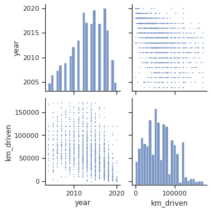
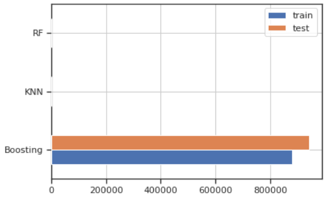

# Laporan Proyek Machine Learning - Alfin Muhammad Ilmi

## Domain Proyek

Saat ini, masyarakat memiliki aktivitas dan bisnis masing-masing sehingga masyarakat memerlukan alat untuk memudahkan dirinya untuk berpindah dari suatu tempat ke tempat yang lain. Salah satu yang dibutuhkan oleh masyarakat saat ini adalah mobil. Namun saat ini perusahaan telah memperkenalkan banyak fitur canggih pada mobil baru sehingga harga mobil baru meningkat. Selain itu, jika kurs rupiah melemah, maka produsen mobil yang ada di Indonesia akan menaikkan harga jual kendaraannya. [[1]](https://d1wqtxts1xzle7.cloudfront.net/56966166/makalah_ku_senabakti_2015-with-cover-page-v2.pdf?Expires=1669132060&Signature=V9JXts1uHEtWLqZiAUq8iyl04pHpZl2raAiyOT22VoTJmcD71IZL446XOB9Y6N65M-zAbJOT-9QV5ZgAK~EDF0901V-vMYfOwAFyO54YZ5zjRz6I4vm8MDwCU1qLVb4Q4wlxbVIaXqZ7SozXhCPGvZRiP-j1FBwCBON9taR2wUgKpmGyQacR9ubgYwy0HfSSu4XSVMLBXUlSVJVaxgiWwV8vGBNcEeoELRlNpWP9SY~FBEkVaqnDF-z1OXcSxqncyd11jDOU6q-GNzVZYG~oXvC0-e360hmMszxW0Aiqd2V~wO7LsTbf8bMAEHwqM~pvmCvEhJ0Ys8MoRoIBbPTXdg__&Key-Pair-Id=APKAJLOHF5GGSLRBV4ZA). Sehingga sebagian masyarakat lebih memilih untuk membeli mobil bekas. Agar masyarakat tidak merugi saat membeli mobil bekas, masyarakat perlu memperkirakan terlebih dahulu harga mobil bekas yang diinginkan.

## Business Understanding

### Problem Statements

- Bagaimana masyarakat mendapatkan mobil bekas yang diinginkan dengan harga terbaik agar tidak mengalami kerugian saat membeli mobil bekas?

### Goals

- Membangun model terbaik untuk melakukan prediksi harga mobil bekas yang digunakan sebelum membeli mobil bekas agar masyarakat tidak mengalami kerugian saat membelinya.

### Solution statements
- Menawarkan solusi sistem prediktif menggunakan metode regresi dengan tiga model yang berbeda (KNN, RandomForest, Boosting) dengan *hyperparameter tuning*. Selain itu, metrik *Mean Squared Error* (MSE) digunakan untuk mengukur kinerja model. Lalu model terbaik harus memperoleh nilai MSE terkecil dari dataset uji.

## Data Understanding
Berdasarkan sumber dataset: [Vehicle dataset - Kaggle](https://www.kaggle.com/datasets/nehalbirla/vehicle-dataset-from-cardekho) diperoleh informasi bahwa Dataset ini berisi informasi tentang harga mobil bekas sesuai dengan rincian informasi yang ada.

### Variabel-variabel pada *Vehicle* dataset adalah sebagai berikut:
- *name* adalah nama mobil.
- *year* adalah tahun mobil saat dibeli.
- *selling_price* adalah harga jual mobil tersebut.
- *km_driven* adalah Jumlah Kilometer mobil dikemudikan.
- *fuel* adalah jenis bahan bakar mobil. Adapun rincian jenis bahan bakar adalah sebagai berikut:
  - *Petrol* yang berarti bensin.
  - *Diesel* yang berarti solar.
  - *CNG (Compressed Natural Gas)* yang berarti gas alam terkompresi.
  - *LPG (Liquefied Petroleum Gas)* yang berarti gas minyak cair
  - *Electric* yang berarti listrik.
- *seller_type* untuk memberitahukan apakah penjual merupakan *Individual*	(perorangan) atau *Dealer*.
- *transmission* adalah transmisi gigi mobil (*Automatic/Manual*)
- *owner* adalah jumlah pemilik mobil sebelumnya.

## Data Preparation
Pada bagian ini kita akan melakukan empat tahap persiapan data, yaitu:
- Encoding fitur kategori.
- Reduksi dimensi dengan Principal Component Analysis (PCA).
- Pembagian dataset dengan fungsi train_test_split dari library sklearn.
- Standarisasi.

### Encoding Fitur Kategori
Tahap encoding pada kasus ini menggunakan teknik *one-hot-encoding* dari *library scikit-learn*. Proses encoding dilakukan pada tiga fitur kategori, yaitu *fuel*, *seller_type*, *transmission*, dan *owner*. Proses encoding dilakukan dengan fitur `get_dummies`.

### Reduksi Dimensi dengan Principal Component Analysis (PCA)
Teknik reduksi (pengurangan) dimensi adalah prosedur yang bertujuan untuk mengurangi jumlah fitur dengan tetap mempertahankan informasi pada data. Teknik pengurangan dimensi yang populer adalah *Principal Component Analysis* (PCA). PCA adalah teknik untuk mereduksi dimensi, mengekstraksi fitur, dan mentransformasi data dari “*n-dimensional space*” ke dalam sistem berkoordinat baru dengan dimensi m, di mana m lebih kecil dari n. PCA umumnya digunakan ketika variabel dalam data yang memiliki korelasi yang tinggi.

Gambar 1. Visualisasi Hubungan antara Fitur Numerik dengan pairplot() pada Data Latih

Selanjutnya perlu dilakukan reduksi fitur `year` dan `km_driven` karena keduanya berkorelasi kuat yang dapat dilihat pada Gambar 1. di atas.

Namun, sebelum perlu dilihat proporsi informasi dari komponen-komponen (*Principal Component*) hasil dari PCA yang nantinya dijadikan patokan dalam mereduksi fitur. Untuk implementasinya menggunakan fungsi `PCA()` dari sklearn dengan mengatur nilai parameter `n_components` sebanyak fitur yang akan dikenakan PCA dalam hal ini ada dua yaitu *year* dan *km_driven*.

Tabel 1. Proporsi *Principal Component* Dari Hasil PCA Fitur *year* dan *km_driven*

| PC Pertama | PC Kedua |
|:---:|:---:|
|  1. |  0. |

Arti dari Tabel 1. di atas adalah, 100% informasi pada kedua fitur `year` dan `km_driven` terdapat pada PC (*Principal Component*) pertama. Sedangkan sisanya sebesar 0% terdapat pada PC kedua.

Berdasarkan hasil tersebut, selanjutnya akan dilakukan reduksi fitur dan hanya mempertahankan PC (komponen) pertama saja. PC pertama ini akan menjadi fitur baru yang menggantikan dua fitur lainnya (`year` dan `km_driven`). Fitur baru tersebut diberi nama `year_km_pca` (*year & km_driven* PCA). Untuk implementasinya diubah nilai parameter `n_components` menjadi 1 (PC Pertama).

### Train-Test-Split
Membagi dataset menjadi data latih (*train*) dan data uji (*test*) merupakan hal yang harus dilakukan sebelum membuat model. Tujuan langkah ini adalah agar tidak mengotori data uji dengan informasi yang didapat dari data latih. 

Pada kasus ini digunakan proporsi pembagian sebesar 80:20 dengan fungsi `train_test_split` dari sklearn dengan *output* sebagai berikut.

Tabel 2. Jumlah Data Latih dan Uji

| Jumlah Data Latih | Jumlah Data Uji | Jumlah Total Data |
|:---:|:---:|:---:|
| 3086 | 772 | 3858 |

### Standarisasi 
Standardisasi adalah teknik transformasi yang paling umum digunakan dalam tahap persiapan pemodelan. Proses standarisasi bertujuan untuk membuat fitur data menjadi bentuk yang lebih mudah diolah oleh algoritma. Pada kasus ini akan digunakan metode `StandarScaler()` dari *library* Scikitlearn.

StandardScaler melakukan proses standarisasi fitur dengan mengurangkan *mean* (nilai rata-rata) kemudian membaginya dengan standar deviasi untuk menggeser distribusi.  StandardScaler menghasilkan distribusi dengan standar deviasi sama dengan 1 dan *mean* sama dengan 0.

Berikut *output* yang dihasilkan dari metode StandardScaler dengan menggunakan fungsi `describe()`:

Tabel 3. Hasil Proses Standarisasi Pada Fitur Pada Data Latih

|  | year_km_pca |
| :---: | ---: |
| count | 3086.0000 |
| mean |-0.0000 |
| std | 1.0002 |
| min | -1.7260 |
| 25% | -0.7642 |
| 50% | -0.0772 |
| 75% | 0.7472 |
| max | 3.0006 |

## Model Development
Pada tahap ini, akan dilakukan pengembangan model *machine learning* dengan tiga algoritma. Kemudian, akan mengevaluasi performa masing-masing algoritma dan menentukan algoritma mana yang memberikan hasil prediksi terbaik. Ketiga algoritma tersebut, antara lain:
1. K-Nearest Neighbor

    KNN adalah algoritma yang relatif sederhana dibandingkan dengan algoritma lain. Algoritma KNN menggunakan kesamaan fitur untuk memprediksi nilai dari setiap data yang baru.
2. Random Forest
  
    Kelebihannya yaitu dapat mengatasi noise dan missing value serta dapat mengatasi data dalam jumlah yang besar. Dan kekurangannya yaitu interpretasi yang sulit dan membutuhkan tuning model yang tepat untuk data.
3. Boosting Algorithm

    Kelebihan algoritma Boosting adalah menggunakan teknik Boosting yang berusaha menurunkan bias dengan berjalan secara sekuensial (memperbaiki model di tiap tahapnya).

Langkah pertama membuat DataFrame baru `models` untuk menampung nilai metrik pada setiap model / algoritma. Ini berguna untuk melakukan analisa perbandingan antar model. Metrik yang digunakan untuk mengevaluasi model adalah MSE (*Mean Squared Error*).

### K-Nearest Neighbor
KNN bekerja dengan membandingkan jarak satu sampel ke sampel pelatihan lain dengan memilih sejumlah k tetangga terdekat. Pemilihan nilai k sangat penting dan berpengaruh terhadap performa model. Jika kita memilih k yang terlalu rendah, maka akan menghasilkan model yang overfitting dan hasil prediksinya memiliki varians tinggi. Jika kita memilih k yang terlalu tinggi, maka model yang dihasilkan akan underfitting dan prediksinya memiliki bias yang tinggi

### Random Forest
Algoritma Random Forest adalah salah satu algoritma *supervised learning*. Ia dapat digunakan untuk menyelesaikan masalah klasifikasi dan regresi. Random forest juga merupakan algoritma yang sering digunakan karena cukup sederhana tetapi memiliki stabilitas yang mumpuni. Random forest merupakan salah satu model machine learning yang termasuk ke dalam kategori *ensemble* (group) learning.

Kita akan menggunakan `RandomForestRegressor` dari library scikit-learn. Kita juga mengimpor mean_squared_error sebagai metrik untuk mengevaluasi performa model. Selanjutnya, kita membuat variabel RF dan memanggil RandomForestRegressor dengan beberapa nilai parameter. Berikut adalah parameter-parameter yang digunakan:
- n_estimator: jumlah *trees* (pohon) di *forest*. Di sini kita set n_estimator=50.
- max_depth:  kedalaman atau panjang pohon. Ia merupakan ukuran seberapa banyak pohon dapat membelah (*splitting*) untuk membagi setiap node ke dalam jumlah pengamatan yang diinginkan.
- random_state: digunakan untuk mengontrol random *number generator* yang digunakan.
- n_jobs: jumlah *job* (pekerjaan) yang digunakan secara paralel. Ia merupakan komponen untuk mengontrol *thread* atau proses yang berjalan secara paralel. n_jobs=-1 artinya semua proses berjalan secara paralel.

### Boosting Algorithm
Teknik boosting bekerja dengan membangun model dari data latih. Kemudian ia membuat model kedua yang bertugas memperbaiki kesalahan dari model pertama. Model ditambahkan sampai data latih terprediksi dengan baik atau telah mencapai jumlah maksimum model untuk ditambahkan. Kita akan menggunakan metode adaptive boosting. Salah satu metode adaptive boosting yang terkenal adalah AdaBoost.

Parameter-parameter (*hyperparameter*) yang digunakan pada algoritma ini antara lain:
* learning_rate: bobot yang diterapkan pada setiap *regressor* di masing-masing iterasi Boosting.
* random_state: digunakan untuk mengontrol *random number generator* yang digunakan.

### Model Terbaik berdasarkan Nilai MSE pada Data Latih
Pada tahap ini, hanya dibatasi pada data latih karena penggunaan data uji akan dilakukan pada proses evaluasi model. Berdasarkan DataFrame `mse` diperoleh:

Tabel 4. Nilai MSE pada Setiap Model dengan Data Latih
| | train |
|:---:|---:|
| KNN | 805.396255 |
| RF | 64.808421 |
| Boosting | 878475.437591 |

Dari Tabel 4. di atas, dapat diketahui bahwa model terbaik dipegang oleh Random Forest dengan nilai MSE 64.808421 (terkecil).

## Evaluation
Dari proses sebelumnya, telah dibangun dan dilatih tiga model yang berbeda, yaitu KNN, Random Forest, dan Boosting. Selanjutnya model-model perlu dievaluasi menggunakan data uji dan metrik yang digunakan dalam kasus ini yaitu `mean_squared_error`. Hasil evaluasi kemudian disimpan ke dalam variabel `mse`.

Gambar 2. Formula MSE

Keterangan formula MSE pada gambar 10:
- MSE = *Mean Squared Error*
- n = banyaknya data point (baris)
- Y_i = nilai yang diobservasi (fitur target `PE`)
- Y^_i = hasil prediksi

Cara kerja metrik MSE adalah dengan menghitung selisih hasil prediksi dengan nilai fitur target (`selling_price`). Nilai selisih tersebut, disebut juga sebagai nilai eror yang kemudian di kuadratkan untuk menangani nilai selisih negatif, selanjutnya hasil pengkuadratan setiap nilai selisih dijumlahkan dan terakhir dibagi dengan banyak data point (n) untuk memperoleh nilai rata-ratanya. Rata-rata inilah yang disebut *Mean Squared Error* (MSE). Metrik MSE kerap digunakan untuk mengevaluasi model regresi seperti pada kasus ini.

Berdasarkan DataFrame `mse` diperoleh:

Tabel 5. Nilai MSE pada Setiap Model dengan Data Uji

| | KNN | RandomForest | Boosting |
|:---:|---:|---:|---:|
| Test MSE | 1421.824348 | 658.435559 | 941031.825367 |

Untuk memudahkan, dilakukan plot hasil evaluasi model dengan *bar chart* sebagai berikut:

Gambar 3. Bar Chart Hasil Evaluasi Model dengan Data Latih dan Uji

Dari Gambar 2 dan 3 di atas, terlihat bahwa, model RandomForest memberikan nilai eror (MSE) yang paling kecil. Sedangkan model algoritma Boosting memiliki eror yang paling besar. Sebelum memutuskan model terbaik untuk melakukan prediksi harga mobil bekas, perlu dilakukan uji prediksi menggunakan beberapa sampel acak (3) pada data uji dengan hasil sebagai berikut:

Tabel 6. Hasil Prediksi dari 3 Sampel Acak

| index_sample | y_true | prediksi_KNN | prediksi_RF | prediksi_Boosting |
|:---:|:---:|:---:|:---:|:---:|
| 1154 | 245000 | 245000.0 | 245000.0 | 219532.6 |
| 1218 | 190000 | 190000.0 | 190000.0 | 218429.8 |
| 1642 | 160000 | 160000.0 | 160000.0 | 113833.4 |

Dari Tabel 6. terlihat bahwa prediksi dengan Random Forest (RF) dan K-Nearest Neighbors (KNN) memberikan hasil yang paling mendekati. Untuk penentuan model terbaik akan disampaikan di bagian kesimpulan.

## Conclusion
Berdasarkan hasil evaluasi model di atas, dapat disimpulkan bahwa model terbaik untuk melakukan prediksi harga mobil adalah model Random Forest. Dengan pengaturan parameter 'n_estimators': 50, 'max_depth': 16 diperoleh nilai metrik MSE sebesar 64.808 (pada data latih) dan 658.435 (pada data uji).
